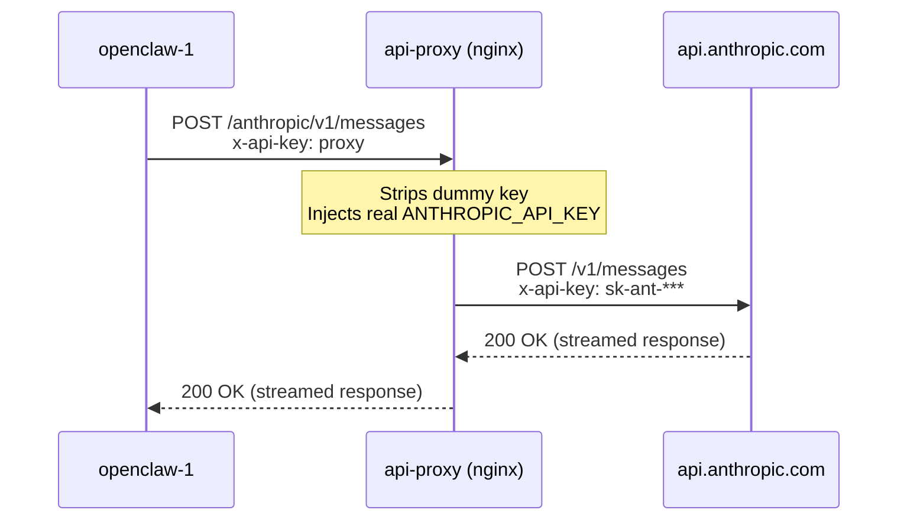
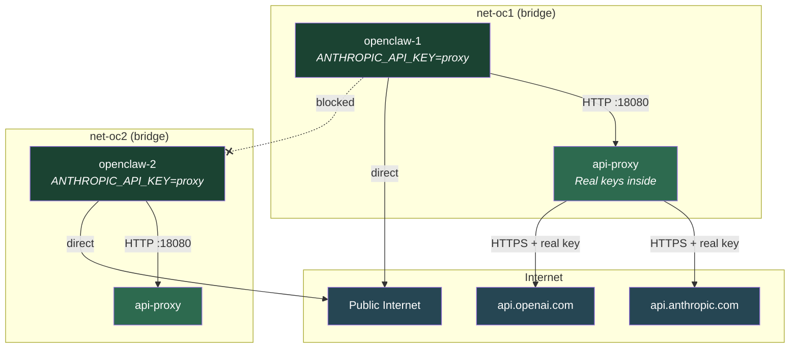
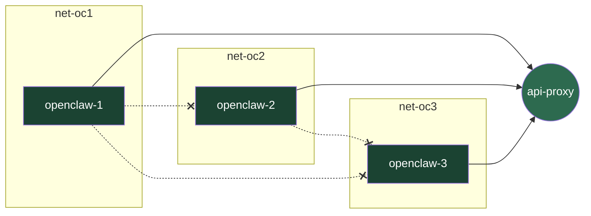

# Architecture: API Proxy & Network Isolation

## How the Reverse Proxy Works

The API proxy is a lightweight nginx container that sits between the OpenClaw containers and the upstream LLM APIs. It is the **only** component that holds real API keys. OpenClaw containers never see them.

### Request Flow

### Network Topology

Each OpenClaw container is placed on its own isolated Docker bridge network. The proxy bridges all networks so it can serve every container, but the containers cannot reach each other.

> `api-proxy` appears twice in the diagram because it is a single container connected to **both** networks simultaneously. Docker allows this — the container gets one virtual interface per network.

### What the Proxy Does

1. **Receives** an HTTP request from an OpenClaw container on port 18080
2. **Routes** based on path prefix:
   - `/anthropic/*` → `https://api.anthropic.com/*`
   - `/openai/*` → `https://api.openai.com/*`
   - Everything else → connection dropped (HTTP 444)
3. **Replaces** the authentication header with the real API key
4. **Forwards** the request upstream over HTTPS
5. **Streams** the response back without buffering (important for SSE/streaming completions)

### Why the Key Can't Be Stolen

| Attack Vector | Why It Fails |
|---|---|
| Read env vars from inside OpenClaw container | Container only has `ANTHROPIC_API_KEY=proxy` — a dummy value |
| Redirect proxy to send key to attacker server | Upstream hosts are hardcoded in nginx config (`api.anthropic.com`, `api.openai.com`) |
| Access proxy container's environment | Containers are on different Docker namespaces; no shared filesystem or Docker socket |
| Inspect proxy via Docker API | Docker socket is not mounted into any container |
| Read key from proxy's filesystem | Proxy runs with `read_only: true`; config is baked into the image at build time and key is only in memory via envsubst |
| Man-in-the-middle the proxy | `NET_RAW` capability is dropped everywhere; ARP spoofing is not possible |

### Adding More Containers

When you run `./manage.sh add 3`, the script:

1. Creates a new bridge network `openclaw-containers_net-oc3`
2. Connects `api-proxy` to that network
3. Starts `openclaw-3` on that network with dummy credentials pointing at the proxy

The new container is automatically isolated from all other OpenClaw containers.

