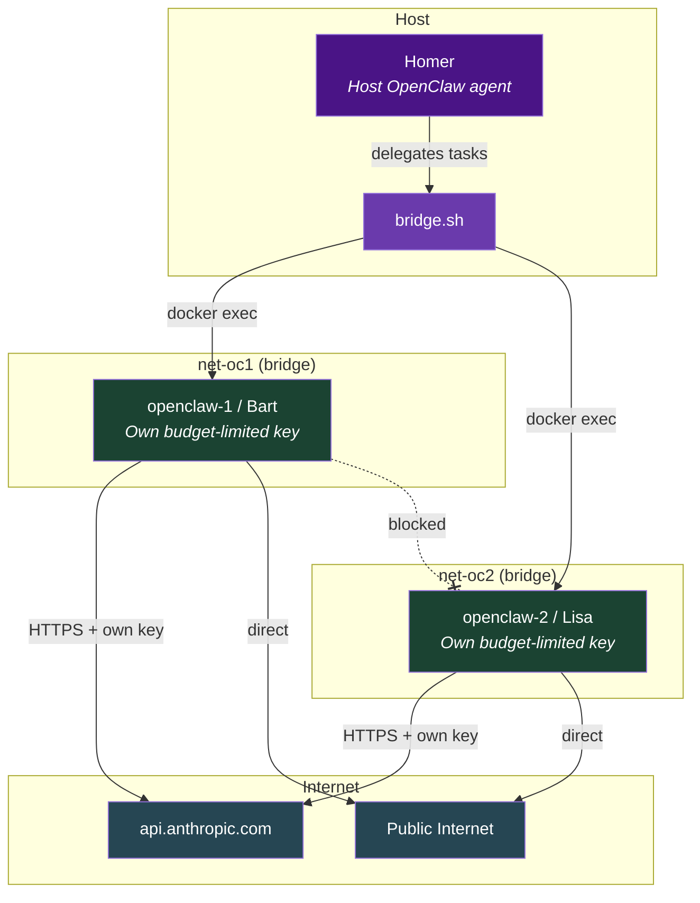
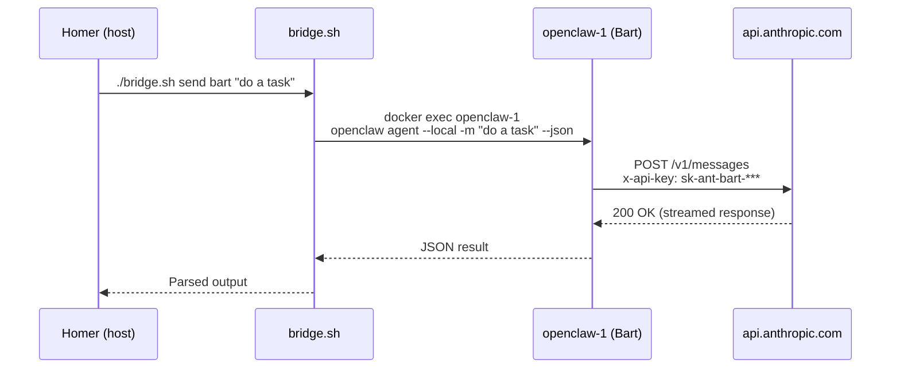
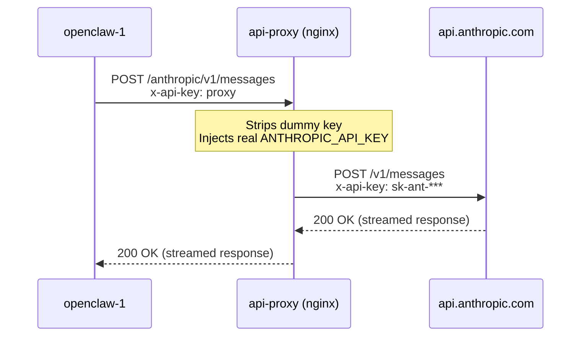
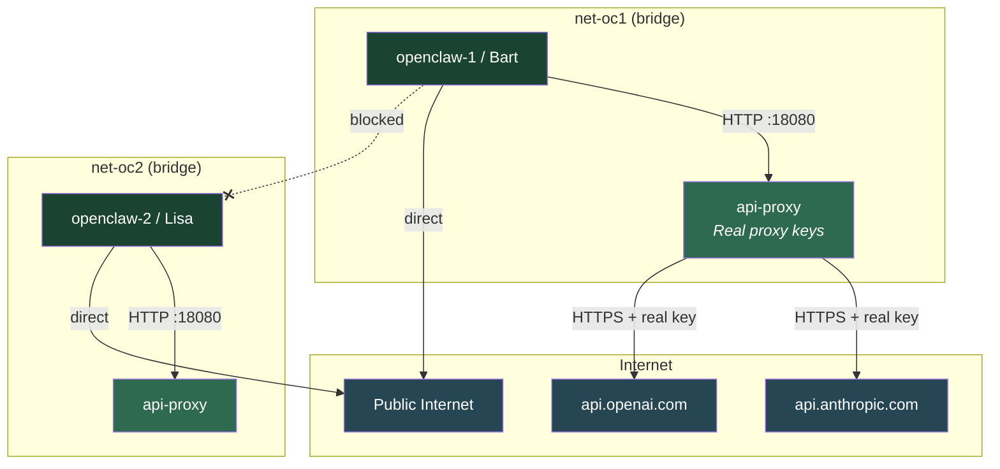
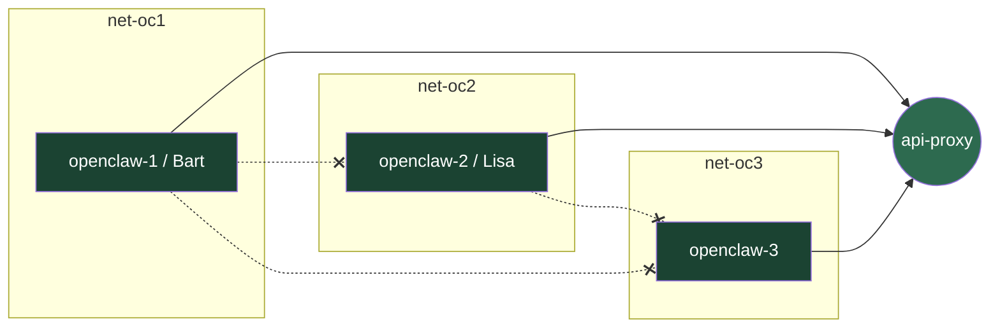

# Architecture: Network Isolation, API Keys & Multi-Agent Bridge

## Current Model: Direct Budget-Limited Keys

Each OpenClaw container has its own budget-limited Anthropic API key and calls the API directly. Homer (on the host) coordinates Bart and Lisa via `bridge.sh` using `docker exec`.

### Agent Topology

### Request Flow (Current — Direct Keys)

## Aspirational Model: Reverse Proxy (Not Currently Active)

The proxy infrastructure is in place and verified to work at the HTTP level (tested with curl). However, OpenClaw's `--local` agent mode bypasses `ANTHROPIC_BASE_URL` and calls Anthropic directly using its stored key from `auth-profiles.json`.

**Status:** Blocked by [openclaw/openclaw#3307](https://github.com/openclaw/openclaw/issues/3307)

If/when OpenClaw respects `ANTHROPIC_BASE_URL`, we can switch back to this model where containers never see real API keys.

### Request Flow (Aspirational — Proxy Model)

### Network Topology (Unchanged)

The network isolation is the same in both models. Each OpenClaw container is on its own Docker bridge network. The proxy bridges all networks.

> `api-proxy` appears twice in the diagram because it is a single container connected to **both** networks simultaneously. Docker allows this — the container gets one virtual interface per network.

## Proxy Limitation Detail

### What Happens

1. OpenClaw containers have `ANTHROPIC_BASE_URL=http://api-proxy:18080/anthropic` set in their environment
2. When OpenClaw starts in `--local` mode, it reads `~/.openclaw/agents/main/agent/auth-profiles.json`
3. It uses the stored API key and hardcoded `api.anthropic.com` endpoint, ignoring `ANTHROPIC_BASE_URL`
4. Result: API calls go directly to Anthropic, bypassing the proxy entirely

### What Still Works Through the Proxy

- Manual `curl` calls that use `$ANTHROPIC_BASE_URL`
- Scripts inside the container that respect the environment variable
- Any future OpenClaw version that fixes this behavior

### Mitigation

- Each container gets its own Anthropic API key with a **spending budget cap**
- Keys are easily rotated if compromised
- The proxy infrastructure remains deployed and ready to activate

## Port Mapping

Web dashboard access is provided via port mapping:

| Container | Internal Port | Host Port | URL |
|---|---|---|---|
| openclaw-1 (Bart) | 18789 | 18001 | `http://localhost:18001` |
| openclaw-2 (Lisa) | 18789 | 18002 | `http://localhost:18002` |

The gateway must be started inside the container first (via `./manage.sh dashboard N`), then the web dashboard is accessible at the mapped host port.

## What the Proxy Does (When Active)

1. **Receives** an HTTP request from an OpenClaw container on port 18080
2. **Routes** based on path prefix:
   - `/anthropic/*` → `https://api.anthropic.com/*`
   - `/openai/*` → `https://api.openai.com/*`
   - Everything else → connection dropped (HTTP 444)
3. **Replaces** the authentication header with the real API key
4. **Forwards** the request upstream over HTTPS
5. **Streams** the response back without buffering (important for SSE/streaming completions)

## Why the Key Can't Be Stolen (Proxy Model)

| Attack Vector | Why It Fails |
|---|---|
| Read env vars from inside OpenClaw container | Container only has `ANTHROPIC_API_KEY=proxy` — a dummy value |
| Redirect proxy to send key to attacker server | Upstream hosts are hardcoded in nginx config (`api.anthropic.com`, `api.openai.com`) |
| Access proxy container's environment | Containers are on different Docker namespaces; no shared filesystem or Docker socket |
| Inspect proxy via Docker API | Docker socket is not mounted into any container |
| Read key from proxy's filesystem | Proxy runs with `read_only: true`; config is baked into the image at build time and key is only in memory via envsubst |
| Man-in-the-middle the proxy | `NET_RAW` capability is dropped everywhere; ARP spoofing is not possible |

## Adding More Containers

When you run `./manage.sh add 3`, the script:

1. Creates a new bridge network `openclaw-containers_net-oc3`
2. Connects `api-proxy` to that network
3. Starts `openclaw-3` on that network

The new container is automatically isolated from all other OpenClaw containers.

