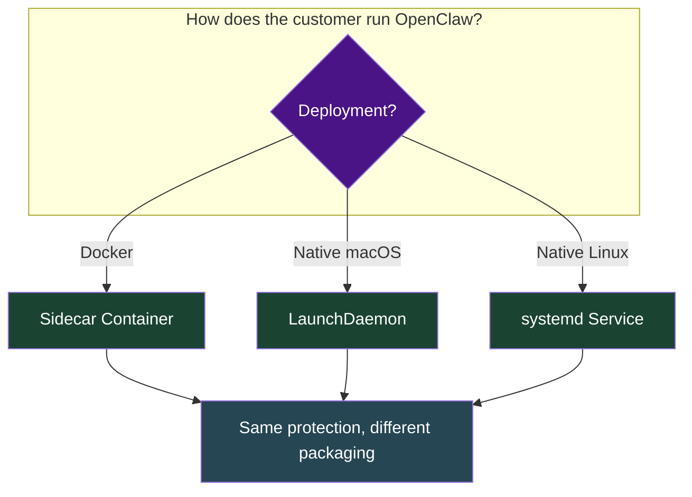
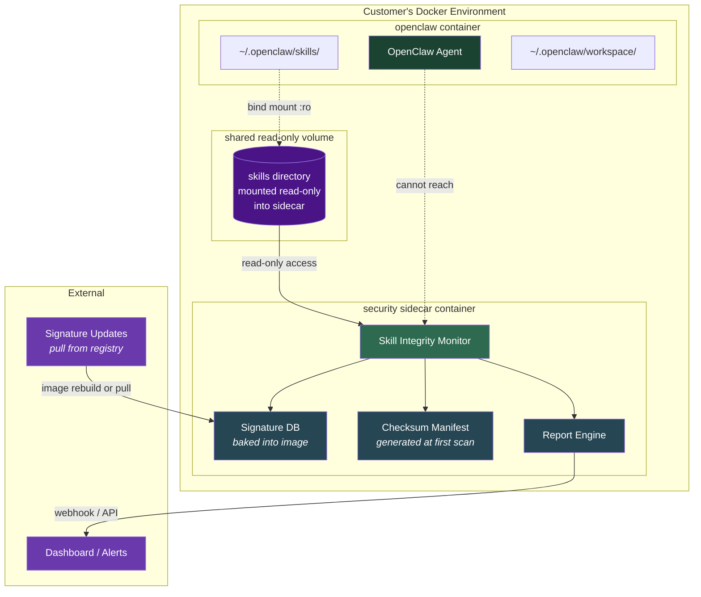
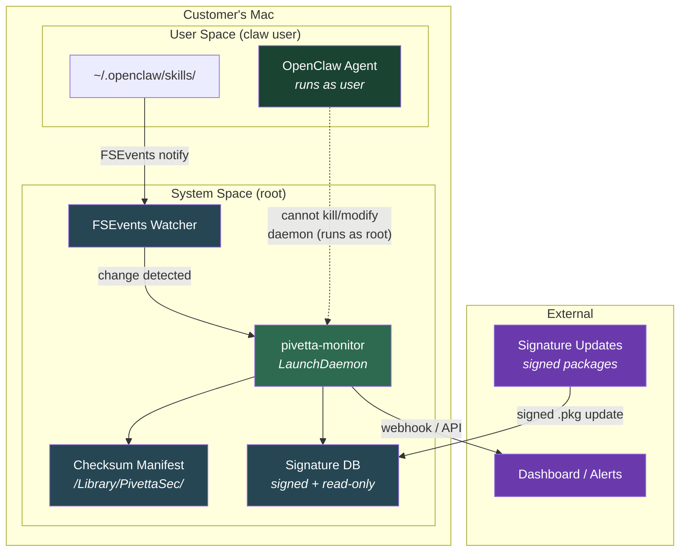

# Security Sidecar: Skill Integrity Monitor

A tamper-proof security product that monitors OpenClaw skill files for post-install modification, credential leakage, and malicious patterns — regardless of how the customer runs OpenClaw.

---

## The Problem

```
    INSTALL TIME                          RUNTIME
    ┌──────────┐                         ┌──────────┐
    │ VirusTotal│  ──── time passes ───► │ Skill is │
    │ Clawdex  │  skill passes scan      │ modified │
    │ Bitdefend│                          │ silently │
    └──────────┘                         └──────────┘
         ✅ Clean                            ❌ Compromised
                                             (nobody notices)
```

All existing tools scan at **install time**. Nothing watches skills at **runtime**. A malicious skill (or compromised process) can rewrite a trusted skill after it passes all checks.

---

## Deployment Models

Three delivery options depending on how the customer runs OpenClaw:



---

## Model 1: Docker Sidecar

For customers running OpenClaw in containers.



### How It Works

1. **Customer adds sidecar to their docker-compose.yml:**

```yaml
services:
  openclaw:
    image: openclaw-sandbox
    volumes:
      - openclaw-skills:/home/claw/.openclaw/skills

  skill-monitor:
    image: pivetta/skill-monitor:latest
    volumes:
      - openclaw-skills:/watch/skills:ro    # read-only!
    environment:
      - SCAN_INTERVAL=60                     # seconds
      - ALERT_WEBHOOK=https://...            # optional
    restart: unless-stopped

volumes:
  openclaw-skills:
```

2. **Sidecar runs a scan loop:**
   - On first run: checksums all skill files, stores manifest
   - Every interval: re-checksums, diffs against manifest
   - On change detected: runs full signature scan on modified files
   - Reports: tamper alert + malicious pattern matches

3. **OpenClaw container cannot reach the sidecar** — different namespace, no shared network needed, skill volume is read-only in the sidecar.

### Why Sidecar Is Tamper-Proof

```
                    OpenClaw Container          Sidecar Container
                    ┌─────────────────┐         ┌─────────────────┐
                    │ Can write skills │         │ Can READ skills │
                    │ Can exec code   │         │ Cannot write    │
                    │ CANNOT reach    │────X────│ CANNOT be       │
                    │ sidecar         │         │ reached         │
                    └─────────────────┘         └─────────────────┘
                                                │
                                                ▼
                                        Scanner binary is
                                        baked into image.
                                        No writable layer
                                        for skill dir.
                                        Separate PID/net
                                        namespace.
```

---

## Model 2: macOS Native (LaunchDaemon)

For customers running OpenClaw directly on their Mac — no Docker.



### macOS-Specific Advantages

| macOS Feature | How We Use It |
|---|---|
| **FSEvents** | Kernel-level file system event notifications. Instant detection when any skill file changes — no polling needed. |
| **LaunchDaemon** | Runs as root via `/Library/LaunchDaemons/`. OpenClaw (running as user) cannot kill, modify, or signal it. Survives logout. |
| **Code Signing** | Monitor binary is signed with a Developer ID. macOS Gatekeeper verifies it. Tampered binary won't launch. |
| **Notarization** | Apple notarizes the .pkg installer. Users get a clean install experience, no security warnings. |
| **System Integrity Protection (SIP)** | Signature DB stored in `/Library/PivettaSec/` — user-space processes cannot modify `/Library/` contents without authorization. |
| **Endpoint Security Framework** | (Advanced) Can hook into ES framework for real-time file operation interception — block writes to skill directories entirely, not just detect. |
| **Keychain** | Store alert webhook credentials in macOS Keychain — not in a config file that OpenClaw could read. |

### Installation

Distributed as a signed `.pkg`:

```bash
# Download and install
curl -O https://releases.pivetta.security/monitor/latest/pivetta-monitor.pkg
sudo installer -pkg pivetta-monitor.pkg -target /

# Installs:
#   /Library/PivettaSec/pivetta-monitor          (binary)
#   /Library/PivettaSec/signatures.db            (threat signatures)
#   /Library/PivettaSec/config.json              (alert config)
#   /Library/LaunchDaemons/com.pivetta.monitor.plist
```

### LaunchDaemon plist

```xml
<?xml version="1.0" encoding="UTF-8"?>
<!DOCTYPE plist PUBLIC "-//Apple//DTD PLIST 1.0//EN"
  "http://www.apple.com/DTDs/PropertyList-1.0.dtd">
<plist version="1.0">
<dict>
    <key>Label</key>
    <string>com.pivetta.skill-monitor</string>
    <key>ProgramArguments</key>
    <array>
        <string>/Library/PivettaSec/pivetta-monitor</string>
        <string>--watch</string>
        <string>/Users/*/. openclaw/skills</string>
    </array>
    <key>RunAtLoad</key>
    <true/>
    <key>KeepAlive</key>
    <true/>
    <key>StandardOutPath</key>
    <string>/Library/Logs/PivettaSec/monitor.log</string>
    <key>StandardErrorPath</key>
    <string>/Library/Logs/PivettaSec/monitor.err</string>
</dict>
</plist>
```

---

## Model 3: Linux Native (systemd)

For customers running OpenClaw on Linux servers or desktops.

```
┌──────────────────────────────────────────────────┐
│ Linux Host                                       │
│                                                  │
│  ┌─────────────────┐   ┌──────────────────────┐ │
│  │ OpenClaw Agent   │   │ pivetta-monitor      │ │
│  │ (runs as user)   │   │ (runs as root)       │ │
│  │                  │   │                      │ │
│  │ ~/.openclaw/     │   │ inotify watcher      │ │
│  │   skills/ ───────────► change detected      │ │
│  │                  │   │   ├─ checksum verify  │ │
│  │                  │   │   ├─ signature scan   │ │
│  │ cannot kill or   │   │   └─ alert/block      │ │
│  │ modify daemon    │   │                      │ │
│  └─────────────────┘   └──────────────────────┘ │
│                                                  │
│  systemd unit: pivetta-monitor.service           │
│  Signatures: /opt/pivetta/signatures.db          │
│  Manifests:  /opt/pivetta/manifests/             │
└──────────────────────────────────────────────────┘
```

Uses `inotify` instead of FSEvents. Same privilege separation — daemon runs as root, OpenClaw runs as user.

---

## What Gets Detected

### Scan Types

```
┌─────────────────────────────────────────────────────────┐
│                    SCAN PIPELINE                        │
│                                                         │
│  1. INTEGRITY CHECK (every scan cycle)                  │
│     SHA-256 of every file in skills/                    │
│     Compare against stored manifest                     │
│     ⚠️ ALERT on any mismatch                            │
│                                                         │
│  2. SIGNATURE SCAN (on new/changed files)               │
│     Pattern match against threat DB                     │
│     - Credential patterns (API keys, tokens)            │
│     - Exfiltration patterns (curl POST, nc, wget)       │
│     - Obfuscation (base64, eval, fromCharCode)          │
│     - Shell injection (exec, spawn, child_process)      │
│     - Known malicious hashes                            │
│                                                         │
│  3. BEHAVIOR ANALYSIS (on new/changed files)            │
│     - Undeclared network calls                          │
│     - Writes outside skill directory                    │
│     - Reads from sensitive paths (.ssh, .env, .aws)     │
│     - Privilege escalation attempts                     │
│                                                         │
│  4. DRIFT DETECTION (periodic)                          │
│     - New files added to skills/                        │
│     - Files deleted from skills/                        │
│     - Permission changes                                │
│     - Unexpected skill directories                      │
└─────────────────────────────────────────────────────────┘
```

### Alert Levels

| Level | Trigger | Action |
|---|---|---|
| **INFO** | New skill installed, permission change | Log only |
| **WARNING** | Suspicious pattern detected, undeclared network call | Log + optional webhook |
| **CRITICAL** | Checksum mismatch (tampering), credential pattern, known malicious hash | Log + webhook + optional block |
| **EMERGENCY** | Active exfiltration pattern, reverse shell, C2 callback | Log + webhook + quarantine skill |

---

## Comparison: Why This Beats Existing Tools

```
                        VirusTotal  Clawdex  Bitdefender  Pivetta Monitor
                        ─────────── ──────── ─────────── ────────────────
Scan at install            ✅         ✅        ✅            ✅
Scan at runtime            ❌         ❌        ❌            ✅
Detect post-install
  tampering                ❌         ❌        ❌            ✅
Tamper-proof scanner       N/A        ❌        N/A           ✅
Works without Docker       N/A        ✅        ✅            ✅
Works with Docker          ✅         ✅        ✅            ✅
Real-time detection        ❌         ❌        ❌            ✅
API for automation         ✅         ✅        ❌            ✅
Runs locally (no cloud)    ❌         ❌        ❌            ✅
Integrity checksums        ❌         ❌        ❌            ✅
```

---

## Architecture Summary

```
┌─────────────────────────────────────────────────────────────┐
│                                                             │
│   CUSTOMER ENVIRONMENT            PIVETTA SECURITY          │
│                                                             │
│   ┌───────────────┐              ┌────────────────────┐     │
│   │   OpenClaw    │              │  Skill Monitor     │     │
│   │   (any mode)  │              │  (tamper-proof)     │     │
│   │               │   watches    │                    │     │
│   │  ~/.openclaw/ ├─────────────►│  Integrity engine  │     │
│   │    skills/    │  (read-only) │  Signature engine   │     │
│   │               │              │  Behavior engine    │     │
│   └───────────────┘              │  Drift engine       │     │
│                                  └─────────┬──────────┘     │
│   Deployment:                              │                │
│   ├─ Docker → sidecar container            │                │
│   ├─ macOS  → LaunchDaemon                 ▼                │
│   └─ Linux  → systemd service      ┌──────────────┐        │
│                                     │  Dashboard   │        │
│                                     │  Alerts      │        │
│                                     │  Reports     │        │
│                                     └──────────────┘        │
│                                                             │
└─────────────────────────────────────────────────────────────┘
```

---

## Key Insight

Every existing tool answers: **"Is this skill safe to install?"**

This product answers: **"Is this skill still the same one you installed?"**

That's the gap. That's the product.
