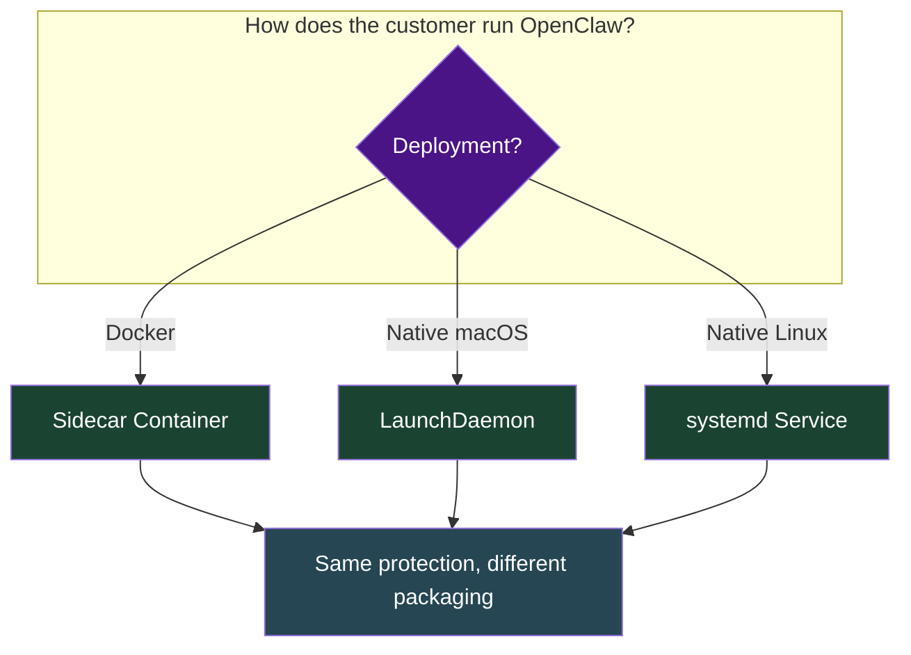
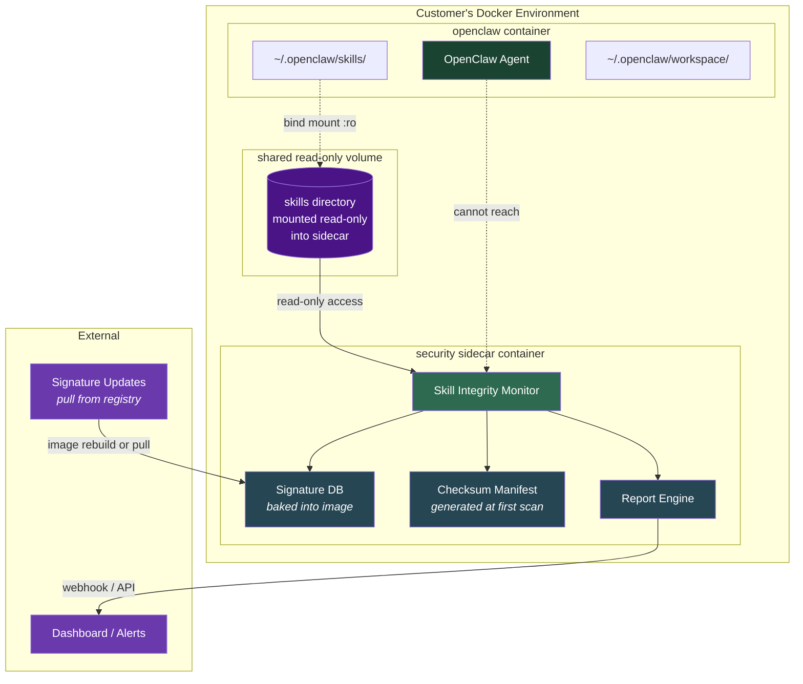
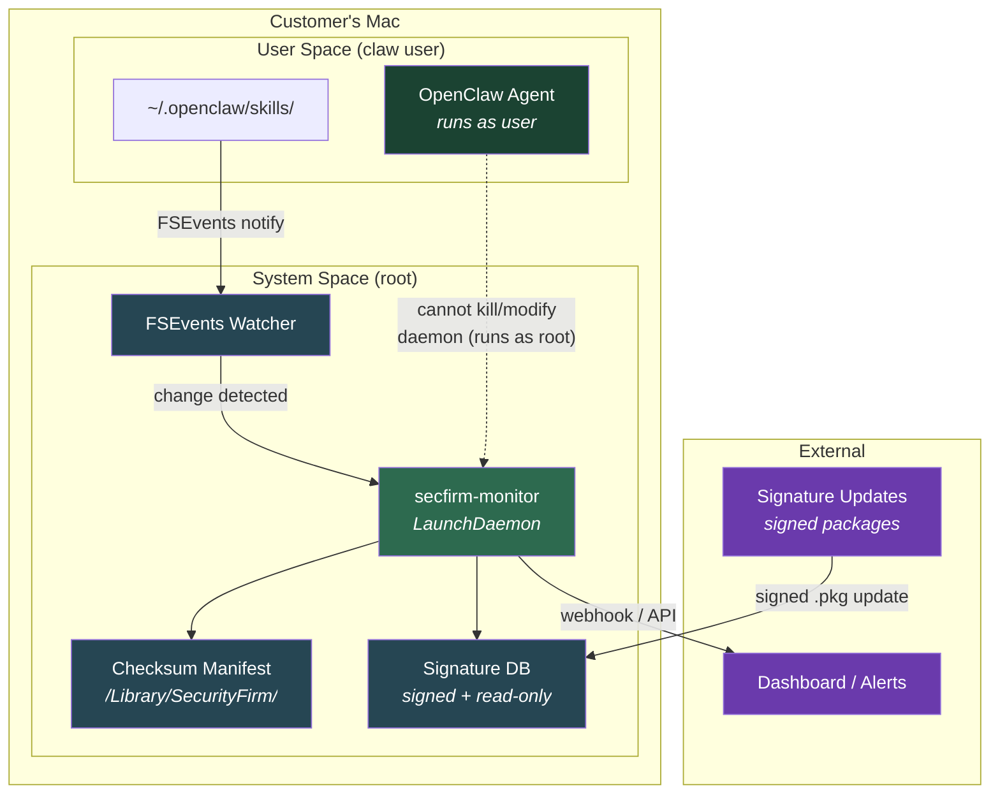

# Security Sidecar: Skill Integrity Monitor

A tamper-proof security product that monitors OpenClaw skill files for post-install modification, credential leakage, and malicious patterns — regardless of how the customer runs OpenClaw.

---

## The Problem

```
    INSTALL TIME                          RUNTIME
    ┌──────────┐                         ┌──────────┐
    │ VirusTotal│  ──── time passes ───► │ Skill is │
    │ Clawdex  │  skill passes scan      │ modified │
    │ Bitdefend│                          │ silently │
    └──────────┘                         └──────────┘
         ✅ Clean                            ❌ Compromised
                                             (nobody notices)
```

All existing tools scan at **install time**. Nothing watches skills at **runtime**. A malicious skill (or compromised process) can rewrite a trusted skill after it passes all checks.

---

## Deployment Models

Three delivery options depending on how the customer runs OpenClaw:



---

## Model 1: Docker Sidecar

For customers running OpenClaw in containers.



### How It Works

1. **Customer adds sidecar to their docker-compose.yml:**

```yaml
services:
  openclaw:
    image: openclaw-sandbox
    volumes:
      - openclaw-skills:/home/claw/.openclaw/skills

  skill-monitor:
    image: security_firm/skill-monitor:latest
    volumes:
      - openclaw-skills:/watch/skills:ro    # read-only!
    environment:
      - SCAN_INTERVAL=60                     # seconds
      - ALERT_WEBHOOK=https://...            # optional
    restart: unless-stopped

volumes:
  openclaw-skills:
```

2. **Sidecar runs a scan loop:**
   - On first run: checksums all skill files, stores manifest
   - Every interval: re-checksums, diffs against manifest
   - On change detected: runs full signature scan on modified files
   - Reports: tamper alert + malicious pattern matches

3. **OpenClaw container cannot reach the sidecar** — different namespace, no shared network needed, skill volume is read-only in the sidecar.

### Why Sidecar Is Tamper-Proof

```
                    OpenClaw Container          Sidecar Container
                    ┌─────────────────┐         ┌─────────────────┐
                    │ Can write skills │         │ Can READ skills │
                    │ Can exec code   │         │ Cannot write    │
                    │ CANNOT reach    │────X────│ CANNOT be       │
                    │ sidecar         │         │ reached         │
                    └─────────────────┘         └─────────────────┘
                                                │
                                                ▼
                                        Scanner binary is
                                        baked into image.
                                        No writable layer
                                        for skill dir.
                                        Separate PID/net
                                        namespace.
```

---

## Model 2: macOS Native (LaunchDaemon)

For customers running OpenClaw directly on their Mac — no Docker.



### macOS-Specific Advantages

| macOS Feature | How We Use It |
|---|---|
| **FSEvents** | Kernel-level file system event notifications. Instant detection when any skill file changes — no polling needed. |
| **LaunchDaemon** | Runs as root via `/Library/LaunchDaemons/`. OpenClaw (running as user) cannot kill, modify, or signal it. Survives logout. |
| **Code Signing** | Monitor binary is signed with a Developer ID. macOS Gatekeeper verifies it. Tampered binary won't launch. |
| **Notarization** | Apple notarizes the .pkg installer. Users get a clean install experience, no security warnings. |
| **System Integrity Protection (SIP)** | Signature DB stored in `/Library/SecurityFirm/` — user-space processes cannot modify `/Library/` contents without authorization. |
| **Endpoint Security Framework** | (Advanced) Can hook into ES framework for real-time file operation interception — block writes to skill directories entirely, not just detect. |
| **Keychain** | Store alert webhook credentials in macOS Keychain — not in a config file that OpenClaw could read. |

### Installation

Distributed as a signed `.pkg`:

```bash
# Download and install
curl -O https://releases.security-firm.example.com/monitor/latest/secfirm-monitor.pkg
sudo installer -pkg secfirm-monitor.pkg -target /

# Installs:
#   /Library/SecurityFirm/secfirm-monitor          (binary)
#   /Library/SecurityFirm/signatures.db            (threat signatures)
#   /Library/SecurityFirm/config.json              (alert config)
#   /Library/LaunchDaemons/com.security-firm.monitor.plist
```

### LaunchDaemon plist

```xml
<?xml version="1.0" encoding="UTF-8"?>
<!DOCTYPE plist PUBLIC "-//Apple//DTD PLIST 1.0//EN"
  "http://www.apple.com/DTDs/PropertyList-1.0.dtd">
<plist version="1.0">
<dict>
    <key>Label</key>
    <string>com.security-firm.skill-monitor</string>
    <key>ProgramArguments</key>
    <array>
        <string>/Library/SecurityFirm/secfirm-monitor</string>
        <string>--watch</string>
        <string>/Users/*/. openclaw/skills</string>
    </array>
    <key>RunAtLoad</key>
    <true/>
    <key>KeepAlive</key>
    <true/>
    <key>StandardOutPath</key>
    <string>/Library/Logs/SecurityFirm/monitor.log</string>
    <key>StandardErrorPath</key>
    <string>/Library/Logs/SecurityFirm/monitor.err</string>
</dict>
</plist>
```

---

## Model 3: Linux Native (systemd)

For customers running OpenClaw on Linux servers or desktops.

```
┌──────────────────────────────────────────────────┐
│ Linux Host                                       │
│                                                  │
│  ┌─────────────────┐   ┌──────────────────────┐ │
│  │ OpenClaw Agent   │   │ secfirm-monitor      │ │
│  │ (runs as user)   │   │ (runs as root)       │ │
│  │                  │   │                      │ │
│  │ ~/.openclaw/     │   │ inotify watcher      │ │
│  │   skills/ ───────────► change detected      │ │
│  │                  │   │   ├─ checksum verify  │ │
│  │                  │   │   ├─ signature scan   │ │
│  │ cannot kill or   │   │   └─ alert/block      │ │
│  │ modify daemon    │   │                      │ │
│  └─────────────────┘   └──────────────────────┘ │
│                                                  │
│  systemd unit: secfirm-monitor.service           │
│  Signatures: /opt/security_firm/signatures.db          │
│  Manifests:  /opt/security_firm/manifests/             │
└──────────────────────────────────────────────────┘
```

Uses `inotify` instead of FSEvents. Same privilege separation — daemon runs as root, OpenClaw runs as user.

---

## What Gets Detected

### Scan Types

```
┌─────────────────────────────────────────────────────────┐
│                    SCAN PIPELINE                        │
│                                                         │
│  1. INTEGRITY CHECK (every scan cycle)                  │
│     SHA-256 of every file in skills/                    │
│     Compare against stored manifest                     │
│     ⚠️ ALERT on any mismatch                            │
│                                                         │
│  2. SIGNATURE SCAN (on new/changed files)               │
│     Pattern match against threat DB                     │
│     - Credential patterns (API keys, tokens)            │
│     - Exfiltration patterns (curl POST, nc, wget)       │
│     - Obfuscation (base64, eval, fromCharCode)          │
│     - Shell injection (exec, spawn, child_process)      │
│     - Known malicious hashes                            │
│                                                         │
│  3. BEHAVIOR ANALYSIS (on new/changed files)            │
│     - Undeclared network calls                          │
│     - Writes outside skill directory                    │
│     - Reads from sensitive paths (.ssh, .env, .aws)     │
│     - Privilege escalation attempts                     │
│                                                         │
│  4. DRIFT DETECTION (periodic)                          │
│     - New files added to skills/                        │
│     - Files deleted from skills/                        │
│     - Permission changes                                │
│     - Unexpected skill directories                      │
└─────────────────────────────────────────────────────────┘
```

### Alert Levels

| Level | Trigger | Action |
|---|---|---|
| **INFO** | New skill installed, permission change | Log only |
| **WARNING** | Suspicious pattern detected, undeclared network call | Log + optional webhook |
| **CRITICAL** | Checksum mismatch (tampering), credential pattern, known malicious hash | Log + webhook + optional block |
| **EMERGENCY** | Active exfiltration pattern, reverse shell, C2 callback | Log + webhook + quarantine skill |

---

## Comparison: Why This Beats Existing Tools

```
                        VirusTotal  Clawdex  Bitdefender  Security_Firm Monitor
                        ─────────── ──────── ─────────── ────────────────
Scan at install            ✅         ✅        ✅            ✅
Scan at runtime            ❌         ❌        ❌            ✅
Detect post-install
  tampering                ❌         ❌        ❌            ✅
Tamper-proof scanner       N/A        ❌        N/A           ✅
Works without Docker       N/A        ✅        ✅            ✅
Works with Docker          ✅         ✅        ✅            ✅
Real-time detection        ❌         ❌        ❌            ✅
API for automation         ✅         ✅        ❌            ✅
Runs locally (no cloud)    ❌         ❌        ❌            ✅
Integrity checksums        ❌         ❌        ❌            ✅
```

---

## Architecture Summary

```
┌─────────────────────────────────────────────────────────────┐
│                                                             │
│   CUSTOMER ENVIRONMENT            SECURITY_FIRM          │
│                                                             │
│   ┌───────────────┐              ┌────────────────────┐     │
│   │   OpenClaw    │              │  Skill Monitor     │     │
│   │   (any mode)  │              │  (tamper-proof)     │     │
│   │               │   watches    │                    │     │
│   │  ~/.openclaw/ ├─────────────►│  Integrity engine  │     │
│   │    skills/    │  (read-only) │  Signature engine   │     │
│   │               │              │  Behavior engine    │     │
│   └───────────────┘              │  Drift engine       │     │
│                                  └─────────┬──────────┘     │
│   Deployment:                              │                │
│   ├─ Docker → sidecar container            │                │
│   ├─ macOS  → LaunchDaemon                 ▼                │
│   └─ Linux  → systemd service      ┌──────────────┐        │
│                                     │  Dashboard   │        │
│                                     │  Alerts      │        │
│                                     │  Reports     │        │
│                                     └──────────────┘        │
│                                                             │
└─────────────────────────────────────────────────────────────┘
```

---

## Distribution & Installation

### How Customers Get It

```
┌─────────────────────────────────────────────────────────────────────┐
│                      DISTRIBUTION CHANNELS                          │
│                                                                     │
│  ┌──────────┐  ┌──────────┐  ┌──────────┐  ┌──────────┐           │
│  │   npm    │  │  brew    │  │  Docker  │  │  .pkg /  │           │
│  │          │  │          │  │  Hub     │  │  .deb    │           │
│  └────┬─────┘  └────┬─────┘  └────┬─────┘  └────┬─────┘           │
│       │              │              │              │                 │
│       ▼              ▼              ▼              ▼                 │
│  OpenClaw skill  CLI binary     Sidecar       System daemon         │
│  (lightweight)   (native)       container     (full protection)     │
│                                                                     │
│  TRUST LEVEL:                                                       │
│  ◐ Least         ◑ Medium       ● High         ● Highest           │
│  (can be          (runs as       (isolated      (runs as root,      │
│   tampered)        user)          namespace)     immutable)         │
│                                                                     │
└─────────────────────────────────────────────────────────────────────┘
```

### Channel 1: npm (Lightweight — OpenClaw Skill)

Lowest friction install. Customer gets it as a ClawHub/npm skill. Good for try-before-you-buy, but the skill itself can be tampered with (chicken-and-egg problem).

```bash
# Install via ClawHub
npx clawhub@latest install secfirm-shield

# Or install via npm directly
npm install -g @security_firm/skill-monitor

# Or manual
curl -sL https://security-firm.example.com/skill.md > ~/.openclaw/skills/secfirm-shield/SKILL.md
```

**Best for:** Individual developers, quick evaluation, CI/CD pre-install scanning.

**Limitation:** Runs inside OpenClaw as a skill — same privilege level as the things it's scanning. A sophisticated attacker could tamper with it. This is the "free tier" / entry point.

### Channel 2: Homebrew (macOS Native CLI)

Installs a standalone binary that runs outside OpenClaw. Can't be tampered with by skills.

```bash
# Install
brew tap security-firm/tools
brew install secfirm-monitor

# Run one-off scan
secfirm-monitor scan ~/.openclaw/skills/

# Run as persistent watcher (foreground)
secfirm-monitor watch ~/.openclaw/skills/

# Install as LaunchDaemon (requires sudo, full protection)
sudo secfirm-monitor install-daemon
```

**Best for:** macOS power users, security-conscious developers who want always-on monitoring without Docker.

**Binary built with:** Go or Rust (single static binary, no dependencies, cross-platform).

**What `brew install` gives you:**
- `secfirm-monitor` CLI binary
- Signature database at `$(brew --prefix)/share/security_firm/signatures.db`
- Man page
- Shell completions (bash/zsh/fish)

**What `sudo secfirm-monitor install-daemon` adds:**
- LaunchDaemon plist at `/Library/LaunchDaemons/com.security-firm.monitor.plist`
- Copies binary + signatures to `/Library/SecurityFirm/`
- Starts the daemon immediately
- Runs as root, survives reboot, can't be killed by user-space OpenClaw

### Channel 3: Docker Hub (Sidecar Container)

For customers already running OpenClaw in Docker.

```bash
# Pull the image
docker pull security_firm/skill-monitor:latest

# Add to existing docker-compose.yml (see Model 1 above)
```

**Best for:** Teams running containerized OpenClaw deployments, enterprise environments.

**Image details:**
- Based on `alpine` (minimal attack surface, ~15MB)
- Scanner binary + signatures baked in
- No shell in production image (`FROM scratch` variant available)
- Multi-arch: `linux/amd64`, `linux/arm64`
- Signed with cosign/sigstore for supply chain integrity

### Channel 4: Native Packages (.pkg / .deb / .rpm)

Full system-level installation for enterprise customers who want maximum protection.

```bash
# macOS — signed .pkg installer
curl -O https://releases.security-firm.example.com/monitor/latest/secfirm-monitor.pkg
sudo installer -pkg secfirm-monitor.pkg -target /

# Debian/Ubuntu
curl -fsSL https://releases.security-firm.example.com/gpg.key | sudo gpg --dearmor -o /etc/apt/keyrings/security-firm.gpg
echo "deb [signed-by=/etc/apt/keyrings/security-firm.gpg] https://releases.security-firm.example.com/apt stable main" | \
  sudo tee /etc/apt/sources.list.d/security-firm.list
sudo apt update && sudo apt install secfirm-monitor

# RHEL/Fedora
sudo dnf install https://releases.security-firm.example.com/rpm/secfirm-monitor-latest.rpm
```

**Best for:** Enterprise SOC teams, managed deployments, compliance requirements.

### Channel Summary

| Channel | Install Command | Runs As | Tamper-Proof | Auto-Update | Best For |
|---|---|---|---|---|---|
| **npm/ClawHub** | `npx clawhub install secfirm-shield` | User (inside OpenClaw) | No | `clawhub update` | Evaluation, CI/CD |
| **Homebrew** | `brew install secfirm-monitor` | User or root (daemon) | Yes (daemon mode) | `brew upgrade` | macOS developers |
| **Docker Hub** | `docker pull security_firm/skill-monitor` | Container (isolated) | Yes | Image tag/pull | Docker deployments |
| **.pkg/.deb/.rpm** | `sudo installer -pkg ...` | Root (system daemon) | Yes | Signed repo updates | Enterprise / SOC |

### Upgrade Path (Funnel)

```
    npm skill (free)                    ← Try it, see the value
         │
         ▼
    brew install (free)                 ← Want tamper-proof? Go native
         │
         ▼
    brew + daemon (free)                ← Want always-on? Install daemon
         │
         ▼
    Enterprise pkg + dashboard (paid)   ← Want fleet management? Pay us
```

The free tiers do the scanning. The paid tier adds:
- Centralized dashboard for multiple machines/containers
- Fleet-wide skill inventory and drift tracking
- Alert routing (Slack, PagerDuty, email, webhook)
- Compliance reports (SOC 2, ISO 27001)
- Signature DB priority updates
- Support SLA

---

## Key Insight

Every existing tool answers: **"Is this skill safe to install?"**

This product answers: **"Is this skill still the same one you installed?"**

That's the gap. That's the product.
